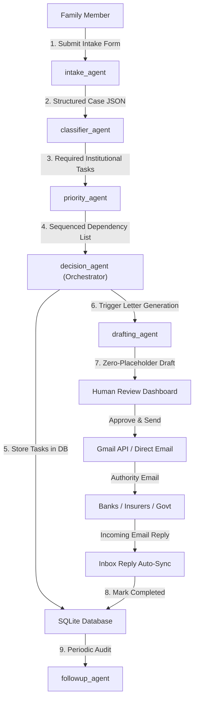

<div align="center">

#  Sahara.ai
### *AI-Powered Multi-Agent Death & Estate Administration Assistant*

[](https://sahara-ai-ten.vercel.app/)
[](https://sahara-ai-backend-ux2f.onrender.com)
[](https://github.com/RajanSita/Sahara-AI)

<br/>

[](https://aicte-india.org)
[](https://sdgs.un.org/goals)
[](https://fastapi.tiangolo.com/)
[](https://groq.com/)
[](https://react.dev/)
[](LICENSE)

<p align="center">
  <b>Sahara.ai</b> absorbs the overwhelming post-death administrative burden for grieving families. It automatically identifies every required institutional task across 50+ banks, insurers, employers, and government offices, generates zero-placeholder legal claim letters, and manages direct email dispatching with PDF attachments and inbox reply tracking — keeping a human reviewer strictly in control.
</p>

[🔗 Explore Live Demo App](https://sahara-ai-ten.vercel.app/) • [⚡ View FastAPI Backend API Docs](https://sahara-ai-backend-ux2f.onrender.com/docs)

</div>

---

## 👥 Team & Submission Credits

<div align="center">

| Role | Contributor | Affiliation |
| :--- | :--- | :--- |
| **Project Lead & Core Developer** | **Rajan** | Vivekananda Institute of Professional Studies (VIPS), GGSIPU |
| **Team Member** | **Ayushi Kapoor** | Vivekananda Institute of Professional Studies (VIPS), GGSIPU |
| **Team Member** | **Gagan Jha** | Vivekananda Institute of Professional Studies (VIPS), GGSIPU |

**Track:** AICTE AI Automation and Intelligent Solutions — *AI for Social Good*  
**Category:** Multi-Agent Autonomous Systems & Legal Workflow Automation

</div>

---

## 📌 UN Sustainable Development Goals (SDGs) Alignment

| SDG | Focus Area | Impact & Social Value |
| :--- | :--- | :--- |
| **SDG 1 — No Poverty** | Asset Protection | Prevents bereaved families from abandoning legitimate financial claims (insurance payouts, provident funds, fixed deposits) due to daunting paperwork and procedural inertia. |
| **SDG 5 — Gender Equality** | Restoring Agency | Widows frequently lose access to joint bank accounts and family assets due to bureaucratic complexity; Sahara.ai restores financial independence and dignity. |
| **SDG 16 — Peace, Justice & Strong Institutions** | Anti-Exploitation | Streamlines access to legal processes (succession certificates, land mutation) without needing informal touts or paying unofficial fees. |

---

## 🌟 Key Features

### 🤖 1. Multi-Agent Autonomous System
Driven by a 6-agent cooperative architecture (Intake, Classifier, Priority, Drafting, Follow-up, Decision Orchestrator) powered by Groq's high-speed `llama-3.3-70b-versatile` model.

### 📝 2. Zero-Placeholder AI Draft Generation
System prompts strictly enforce complete data resolution. Real asset context (Bank Account numbers, IFSC codes, Policy numbers, Property addresses, Employee IDs) is injected into templates, guaranteeing zero `[PLACEHOLDER]` text.

### 🏛️ 3. 100% Authority & Insurer Email Auto-Detection
Pre-populates verified official email addresses for **50+ major institutions**:
- **Banks (50+):** SBI (`customercare@sbi.co.in`), HDFC Bank, ICICI Bank, Axis Bank, PNB, BOB, Canara, Union Bank, Kotak, IndusInd, YES Bank, IDBI, Federal Bank, IDFC First, etc.
- **Life Insurers:** LIC (`bo_claims@licindia.com`), HDFC Life, SBI Life, ICICI Prudential, Max Life, Tata AIA, Bajaj Allianz Life, PNB MetLife, etc.
- **Health Insurers:** Star Health, Care Health, Niva Bupa, ManipalCigna.
- **General & Motor Insurers:** Tata AIG, SBI General, Reliance General, IFFCO Tokio, Cholamandalam MS, Royal Sundaram, Liberty General, Universal Sompo, ICICI Lombard, HDFC ERGO, Go Digit, Acko.
- **Government Authorities:** EPFO (`commissioner@epfindia.gov.in`), District Courts, Municipal Corporations.

### 🔐 4. Google OAuth 2.0 & Direct Gmail API Sending
Seamless single-click login with Google OAuth 2.0. Users dispatch applications directly from their authenticated `@gmail.com` address via the official Gmail API (`users.messages.send`).

### 📎 5. Smart PDF Document Attachment Engine
Automatically resolves and attaches required physical documents uploaded during intake:
- **Universal Proofs:** Death Certificate & Hospital/Cremation Summary attached to outgoing emails.
- **Conditional Proofs:** Property Title Deeds & Tax Receipts attached specifically to Property Municipal tasks.

### 🔄 6. Automated Inbox Reply Tracking
Integrated Gmail API inbox scanner (`users.messages.list` & `users.messages.get`) that checks for official replies from authorities and automatically marks tasks as **Completed**.

### 👤 7. Human-in-the-Loop Review & Case Management
Every draft generated by the AI enters an *"Awaiting Approval"* state on the interactive dashboard where users can review, edit, approve, or delete cases (`DELETE /cases/{case_id}`).

---

## 🏗️ Multi-Agent Architecture Diagram



### 🧠 6-Agent Breakdown

| Agent File | Role & Function |
| :--- | :--- |
| **`intake_agent.py`** | Parses raw user form data and uploaded document metadata into normalized Pydantic schemas. |
| **`classifier_agent.py`** | Maps institutions to required legal tasks and auto-detects official recipient emails. |
| **`priority_agent.py`** | Ranks tasks by urgency and legal dependencies (e.g. Death Certificate blocks Bank transfers). |
| **`drafting_agent.py`** | Synthesizes formal claim applications using LLM prompts injected with full asset context. |
| **`followup_agent.py`** | Monitors pending tasks and generates polite follow-up reminder drafts if unresolved. |
| **`decision_agent.py`** | Orchestrates pipeline execution, enforces state transitions, and guarantees human approval. |

---

## 🛠️ Technology Stack

```
─────────────────────────────────────────────────────────────────────────────
Backend         FastAPI (Python 3.11+), SQLAlchemy ORM, Pydantic v2, Uvicorn
LLM Engine      Groq Cloud API (Llama-3.3-70B-Versatile model)
Google APIs     Google OAuth 2.0, Gmail REST API v1 (Base64 MIME Engine)
Frontend        React 18, Vite, React Router 6, Axios
Styling         Custom Dark Glassmorphism, HSL Tokens, Cormorant Garamond font
Hosting         Vercel (Frontend SPA & Proxy) + Render (FastAPI Web Service)
─────────────────────────────────────────────────────────────────────────────
```

---

## ⚡ Quick Start & Local Setup

### 1. Prerequisites
- Python 3.11+
- Node.js 18+ & npm
- Google Cloud Console OAuth 2.0 Client ID

### 2. Backend Setup
```bash
cd backend
python -m venv venv

# On Windows:
venv\Scripts\activate
# On Linux/macOS:
source venv/bin/activate

pip install -r requirements.txt
python -m uvicorn main:app --reload --port 8000
```

### 3. Frontend Setup
```bash
cd frontend
npm install
npm run dev
```
Open **`http://localhost:5173`** in your browser.

---

## 🌐 Production Deployment URLs

| Component | Provider | Live URL |
| :--- | :--- | :--- |
| **Frontend Web App** | Vercel | [https://sahara-ai-ten.vercel.app/](https://sahara-ai-ten.vercel.app/) |
| **Backend API Server** | Render | [https://sahara-ai-backend-ux2f.onrender.com](https://sahara-ai-backend-ux2f.onrender.com) |
| **Interactive API Docs** | FastAPI Swagger | [https://sahara-ai-backend-ux2f.onrender.com/docs](https://sahara-ai-backend-ux2f.onrender.com/docs) |

---

## 📁 Project Repository Structure

```
Sahara_AI/
├── backend/
│   ├── agents/
│   │   ├── intake_agent.py      # Intake Parsing Agent
│   │   ├── classifier_agent.py  # Task Classification & Email Auto-Detection
│   │   ├── priority_agent.py    # Task Prioritization Agent
│   │   ├── drafting_agent.py    # Letter Drafting Agent
│   │   ├── followup_agent.py    # Follow-up Nudge Agent
│   │   └── decision_agent.py    # Master Orchestrator
│   ├── uploads/                 # Storage for uploaded death certificates & documents
│   ├── database.py              # SQLAlchemy DB Models & Migrations
│   ├── gmail_service.py         # Google OAuth & Gmail API Service
│   ├── llm_client.py            # Groq LLM Client Interface
│   ├── main.py                  # FastAPI Application Routes
│   ├── schemas.py               # Pydantic Schemas
│   └── requirements.txt
├── frontend/
│   ├── src/
│   │   ├── components/          # Navbar, TaskCard, StatusBadge
│   │   ├── pages/               # Landing, Intake, Cases, Dashboard, Review
│   │   ├── api.js               # Axios API Interface
│   │   └── utils.js             # Helpers & Color Tokens
│   ├── index.html
│   ├── vercel.json              # Frontend Proxy Configuration
│   └── package.json
├── logo.png                     # Official Sahara.ai Brand Logo
├── vercel.json                  # Root Deployment Configuration
└── README.md
```

---

## 📜 License

Distributed under the **MIT License**. Developed for **AICTE AI Automation and Intelligent Solutions Hackathon 2026**.

<div align="center">
  <sub>Created with ❤️ for Social Good by Rajan, Ayushi Kapoor, and Gagan Jha</sub>
</div>
