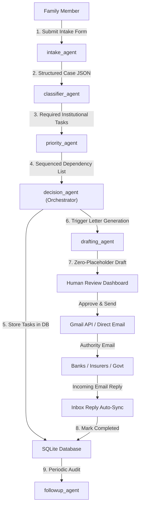

# 🕊️ Sahara.ai — AI-Powered Multi-Agent Death & Estate Administration Assistant

[](https://aicte-india.org)
[](https://sdgs.un.org/goals)
[](https://fastapi.tiangolo.com/)
[](https://groq.com/)
[](https://react.dev/)

> **Sahara.ai** is an intelligent, multi-agent AI system designed to absorb the overwhelming post-death administrative burden for grieving families. It automatically identifies every required institutional task across banks, insurers, employers, and government offices, generates zero-placeholder legal claim letters, and manages direct email dispatching and inbox reply tracking — all while keeping a human reviewer strictly in control.

---

## 👥 Team & Submission Credits

- **Project Lead & Developer:** Rajan
- **Team Members:** Rajan, Ayushi Kapoor, Gagan Jha
- **Track:** AICTE AI Automation and Intelligent Solutions — *AI for Social Good*
- **Institution:** Vivekananda Institute of Professional Studies (VIPS), GGSIP University, New Delhi

---

## 📌 UN Sustainable Development Goals (SDGs) Alignment

| SDG | Focus Area | Impact |
| :--- | :--- | :--- |
| **SDG 1 — No Poverty** | Asset Protection | Prevents families from abandoning legitimate financial claims (insurance payouts, provident funds, fixed deposits) due to daunting paperwork. |
| **SDG 5 — Gender Equality** | Restoring Agency | Widows frequently lose access to joint bank accounts and family assets due to procedural complexity; Sahara.ai restores financial autonomy. |
| **SDG 16 — Peace, Justice & Strong Institutions** | Anti-Exploitation | Streamlines access to legal processes (succession certificates, land mutation) without needing informal touts or paying unofficial fees. |

---

## 🌟 Key Features

### 🤖 1. Multi-Agent Autonomous Reasoning
Driven by a 6-agent cooperative architecture (Intake, Classifier, Priority, Drafting, Follow-up, Decision Orchestrator) using Groq's `llama-3.3-70b-versatile` model.

### 📝 2. Zero-Placeholder AI Draft Generation
System prompts strictly enforce complete data resolution. Real asset context (Bank Account numbers, IFSC codes, Policy numbers, Property addresses, Employee IDs) is injected into templates, guaranteeing zero `[PLACEHOLDER]` text.

### 🏛️ 3. 100% Authority & Insurer Email Auto-Detection
Pre-populates verified official email addresses for:
- **50+ Public & Private Banks:** SBI, HDFC, ICICI, Axis, PNB, BOB, Canara, Union, Kotak, IndusInd, YES, IDBI, India Post Payments Bank, etc.
- **Life Insurance:** LIC, HDFC Life, SBI Life, ICICI Prudential, Max Life, Tata AIA, Bajaj Allianz Life, PNB MetLife, etc.
- **Health Insurance:** Star Health, Care Health, Niva Bupa, ManipalCigna.
- **Vehicle / Motor Insurance:** Tata AIG, SBI General, Reliance General, IFFCO Tokio, Cholamandalam MS, Royal Sundaram, Liberty General, Universal Sompo, ICICI Lombard, HDFC ERGO, Go Digit, Acko.
- **Government Authorities:** EPFO (`commissioner@epfindia.gov.in`), District Courts, Municipal Corporations.

### 🔐 4. Google OAuth 2.0 & Direct Gmail API Sending
Seamless single-click login with Google OAuth 2.0. Users dispatch applications directly from their authenticated `@gmail.com` address via the official Gmail API (`users.messages.send`).

### 📎 5. Selective Document Attachment Engine
Automatically attaches required physical documents (uploaded during intake):
- **Universal Proofs:** Death Certificate & Hospital Summary attached to all outgoing emails.
- **Conditional Proofs:** Property Title Deeds & Tax Receipts attached specifically to Property Municipal tasks.

### 🔄 6. Automated Inbox Reply Tracking
Integrated Gmail API inbox scanner (`users.messages.list` & `users.messages.get`) that checks for official replies from authorities and automatically marks tasks as **Completed**.

### 👤 7. Human-in-the-Loop Review & Case Management
Every draft generated by the AI enters an *"Awaiting Approval"* state on the interactive dashboard where users can review, edit, approve, or delete cases (`DELETE /cases/{case_id}`).

---

## 🏗️ Multi-Agent Architecture



| Agent | Responsibility |
| :--- | :--- |
| **`intake_agent.py`** | Parses raw user input and uploaded document metadata into normalized Pydantic schemas. |
| **`classifier_agent.py`** | Maps institutions to required legal tasks and auto-detects official recipient emails. |
| **`priority_agent.py`** | Ranks tasks by urgency and dependencies (e.g. Death Certificate blocks Bank transfers). |
| **`drafting_agent.py`** | Synthesizes formal claim applications using LLM prompts injected with full asset context. |
| **`followup_agent.py`** | Monitors pending tasks and generates polite follow-up reminder drafts if unresolved. |
| **`decision_agent.py`** | Orchestrates pipeline execution, enforces state transitions, and guarantees human approval. |

---

## 🛠️ Technology Stack

- **Backend:** Python 3.11+, FastAPI, SQLAlchemy, SQLite, Pydantic v2
- **LLM Engine:** Groq API (`llama-3.3-70b-versatile`) with `httpx` fallback client
- **Google Integrations:** `google-auth-oauthlib`, `google-api-python-client` (Gmail API v1)
- **Frontend:** React 18, Vite, React Router 6, Axios
- **Design System:** Custom Dark Glassmorphism, HSL Tokens, Micro-animations, Google Fonts (*Cormorant Garamond*, *Plus Jakarta Sans*)

---

## ⚡ Quick Start & Local Setup

### 1. Prerequisites
- Python 3.11+
- Node.js 18+ & npm
- Google Cloud Console OAuth 2.0 Credentials (with `https://www.googleapis.com/auth/gmail.send` and `https://www.googleapis.com/auth/gmail.readonly` scopes)

### 2. Environment Configuration
Create a `.env` file inside the `backend/` directory:
```env
GROQ_API_KEY=your_groq_api_key
SECRET_KEY=your_jwt_secret_key
GOOGLE_CLIENT_ID=your_google_client_id.apps.googleusercontent.com
GOOGLE_CLIENT_SECRET=your_google_client_secret
FRONTEND_URL=http://localhost:5173
REDIRECT_URI=http://localhost:8000/auth/google/callback
```

### 3. Backend Setup
```bash
cd backend
python -m venv venv
# On Windows:
venv\Scripts\activate
# On Linux/macOS:
source venv/bin/activate

pip install -r requirements.txt
python -m uvicorn main:app --reload --port 8000
```

### 4. Frontend Setup
```bash
cd frontend
npm install
npm run dev
```
Open **[http://localhost:5173](http://localhost:5173)** in your browser.

---

## 🧪 Testing & Email Safeguards

For demo and testing purposes, `backend/agents/classifier_agent.py` contains a test redirection flag:
```python
TESTING_MODE = True
TESTING_EMAIL = "sahara.ai.team@gmail.com"
```
When `TESTING_MODE` is enabled, all generated recipient emails route safely to **`sahara.ai.team@gmail.com`**, while the full production mappings for 50+ banks and insurers remain preserved in code comments. To switch to production mode, set `TESTING_MODE = False`.

---

## 📁 Repository Structure

```
Sahara_AI/
├── backend/
│   ├── agents/
│   │   ├── intake_agent.py      # Intake Parsing Agent
│   │   ├── classifier_agent.py  # Task Classification & Email Auto-Detection
│   │   ├── priority_agent.py    # Task Prioritization Agent
│   │   ├── drafting_agent.py    # Letter Drafting Agent
│   │   ├── followup_agent.py    # Follow-up Nudge Agent
│   │   └── decision_agent.py    # Master Orchestrator
│   ├── uploads/                 # Storage for uploaded death certificates & documents
│   ├── database.py              # SQLAlchemy DB Models & Migrations
│   ├── gmail_service.py         # Google OAuth & Gmail API Service
│   ├── llm_client.py            # Groq LLM Client Interface
│   ├── main.py                  # FastAPI Application Routes
│   ├── schemas.py               # Pydantic Schemas
│   └── requirements.txt
├── frontend/
│   ├── src/
│   │   ├── components/          # Navbar, TaskCard, StatusBadge
│   │   ├── pages/               # Landing, Intake, Cases, Dashboard, Review
│   │   ├── api.js               # Axios API Interface
│   │   └── utils.js             # Helpers & Color Tokens
│   ├── index.html
│   └── package.json
├── DOC/                         # Project Proposal & Documentation
└── README.md
```

---

## 📜 License

Distributed under the MIT License. Developed for **AICTE AI Automation and Intelligent Solutions Hackathon 2026**.
